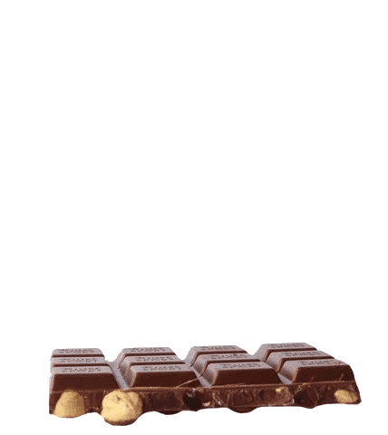

  <h3 align="center">Push Swap</h3>
Code Your Own Stack Sorting Algorithm
   
   

 

# Push Swap

A stack-sorting program that uses two stacks, A and B, where A starts with unique random numbers, and B is initially empty. The goal is to sort the stack by performing and printing specific operations `(e.g., sa, pb)`, which are then validated by a checker program.

### Operations:

 

## Features

  - 📚 Sorting using two stacks.
  - 🔀 Limited set of operations (sa, pb, etc.).
  - 🕹️ Optimized move sequences for sorting.
  - ✅ Validation with a checker program.
  - 🧠 Efficiency in sorting with minimal operations.

 

## Distinctive Features

  - 📚 Averages below 5,500 operations (most minimal).
  - ⏳ Unique sorting method ("Sand Clock").
  - ✅ Custom-built checker for validation.

## Stack Operations

- `sa` Swap the first two elements of stack A.
- `sb` Swap the first two elements of stack B.
- `ss` Perform sa and sb simultaneously.
- `pa` Push the top element from stack B to stack A.
- `pb` Push the top element from stack A to stack B.
- `ra` Rotate stack A upwards (first element becomes the last).
- `rb` Rotate stack B upwards.
- `rr` Rotate both stacks A and B upwards simultaneously.
- `rra` Reverse rotate stack A (last element becomes the first).
- `rrb` Reverse rotate stack B.
- `rrr` Reverse rotate both stacks A and B simultaneously.

 

